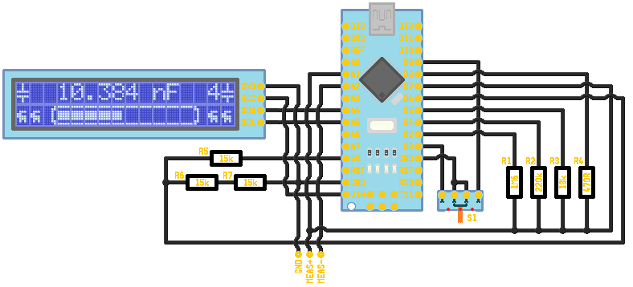

# Arduino_Multimeter
An Arduino-multimeter that can measure cpacitance, resistance, and voltage made with parts i had lying around.

**I like the loadig bar**

## Wireing

## Capacitance Measurement
It Measures the capacitance by measureing the charge times with a set resistor at the input. 
If the measurement goes on for too long it changes the resitor used.
The measurement is timed by the internal Comparator and Timer1 of the Nano.

## Resistanc Measurement 
The resistor forms a simple voltage divider and the ADC measures the voltage of the unknown.

## Voltage Measurement 
It just uses the inbuild ADC with VCC as a reference so its not accurate.
